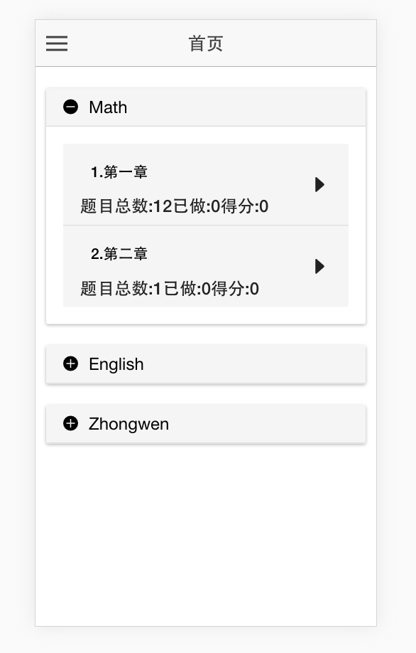
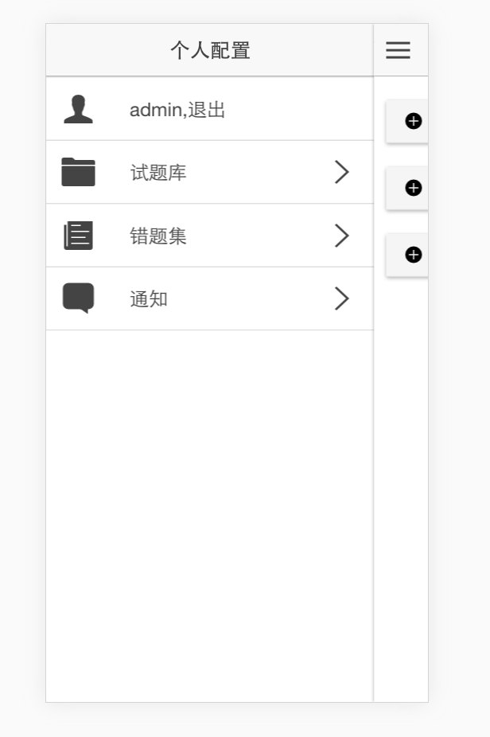
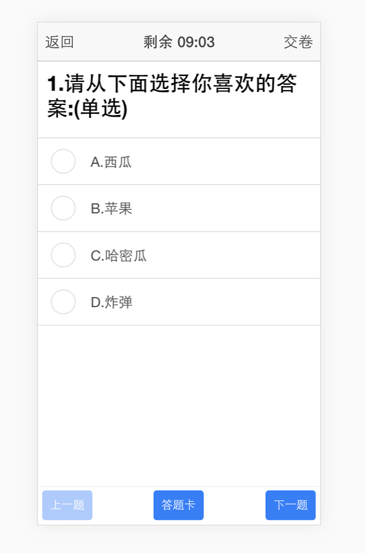
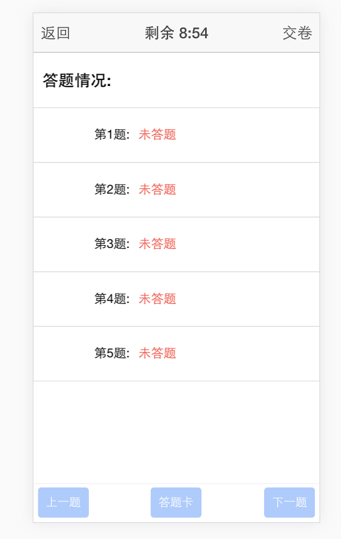
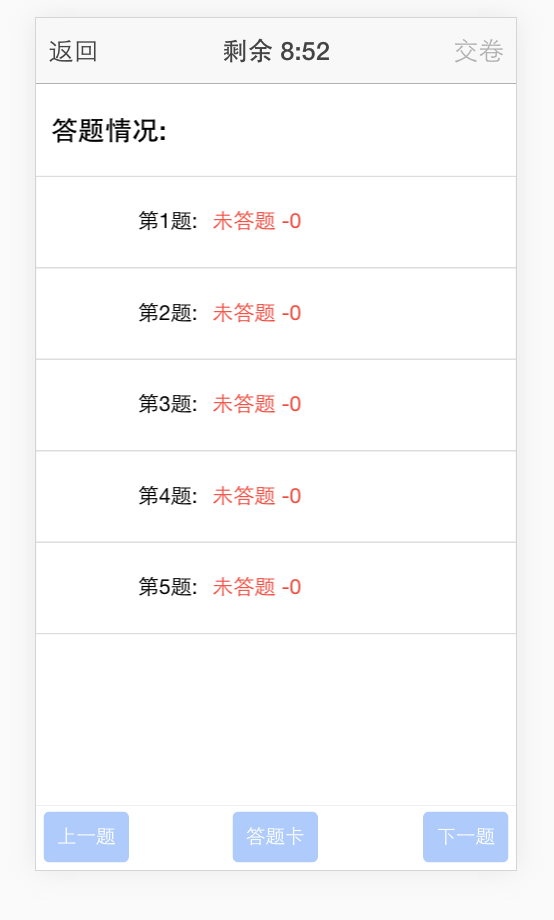

Ionic App Base
=====================

最近准备换工作，把以前做的demo改改，这是一个简单的考试系统：登陆模块、考试计时模块、自动交卷、错题收集以及通知消息模块。
框架和库：ionic  angular  nodejs express mongodb  以及H5的离线存储indexedDB,localStorage
app一览：

## Using this project

myServer 为后端web服务,切换到目录npm install安装依赖
myApp为客户端，用ionic打包

## Issues
喜欢可以和我交流QQ:70380702